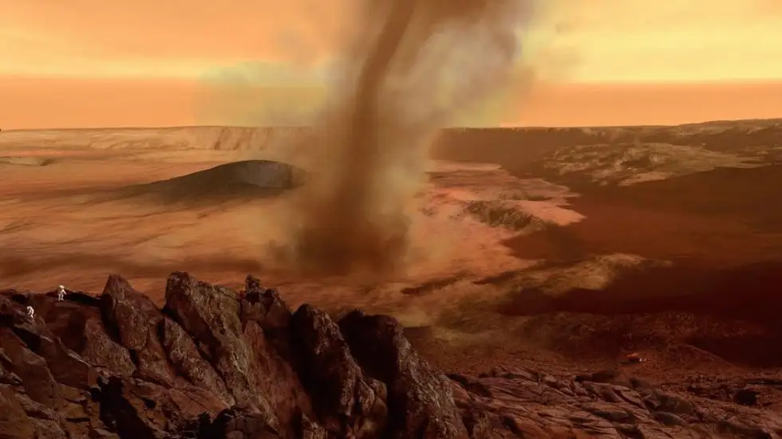
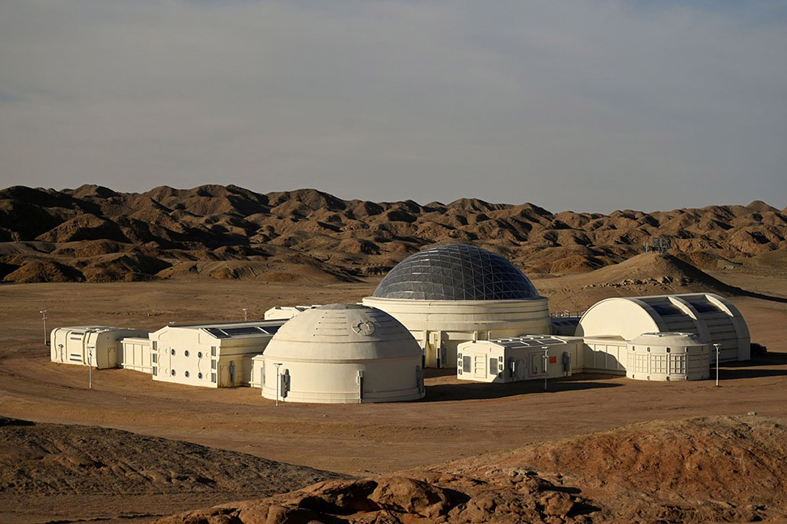
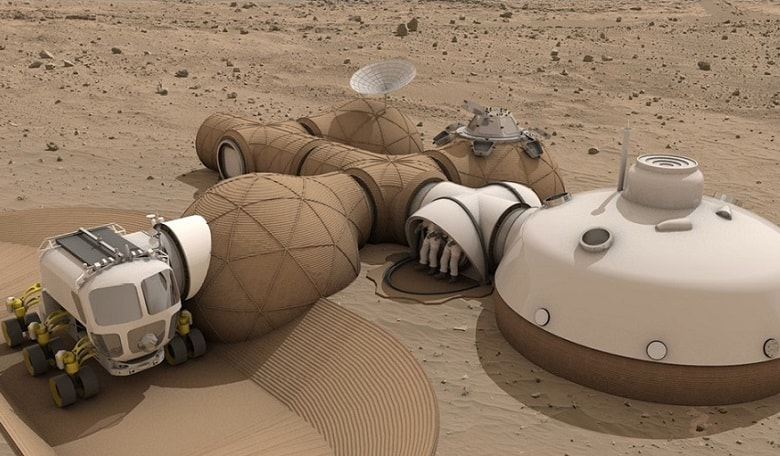
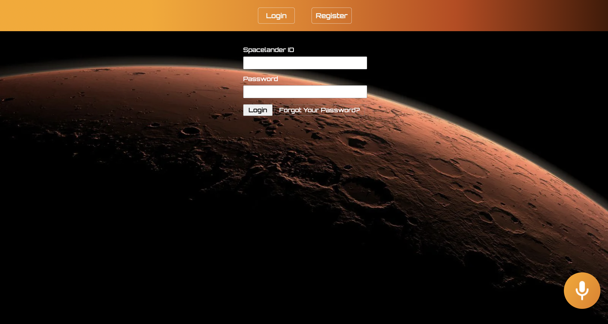
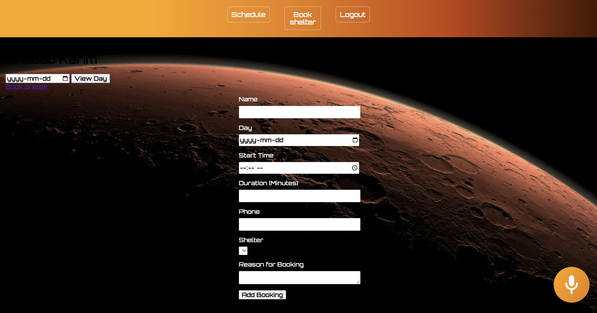

# Spaceden

An application for booking shelter depots in Mars for spacelanders who have to navigate through harsh weather.

### Why?

Imagine a planet very much like the Earth, with similar size, rotation rate and inclination of rotation axis, possessing an atmosphere and a solid surface, but lacking oceans and dense clouds of liquid water. We might expect such a desert planet to be dominated by large variations in day-night and winter-summer weather. Dust storms would be common.
In winter, temperatures can get down to minus 125 degrees C. A summer day on Mars may get up to 20 degrees C near the equator, but at night the temperature can plummet to about minus 73 degrees C. Unlike Earth, the Mars atmosphere is very thin, subjecting the planet to a bombardment of cosmic rays and thus producing cancer.

### Future features:

- Accept payments via Stripe API
- Mars Map
- Better UI
- Visual content of shelters
- About, contact us pages
