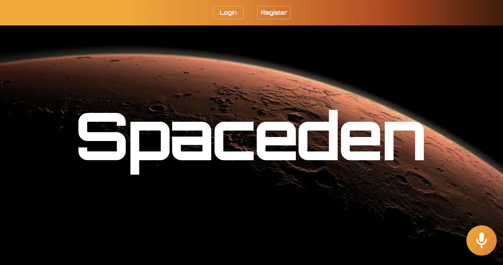

# Spaceden

An application for booking shelter depots in Mars for spacelanders who have to navigate through harsh weather.

### Why?

Imagine a planet very much like the Earth, with similar size, rotation rate and inclination of rotation axis, possessing an atmosphere and a solid surface, but lacking oceans and dense clouds of liquid water. We might expect such a desert planet to be dominated by large variations in day-night and winter-summer weather. Dust storms would be common. Observations and simulations of martian climate confirm these expectations and provide a wealth of detail that can help resolve problems of climate evolution.

